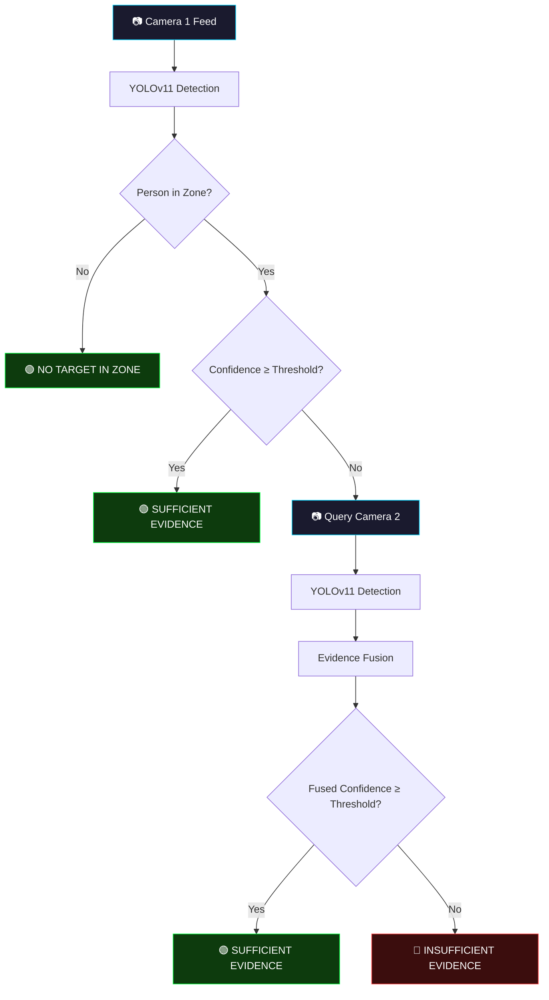
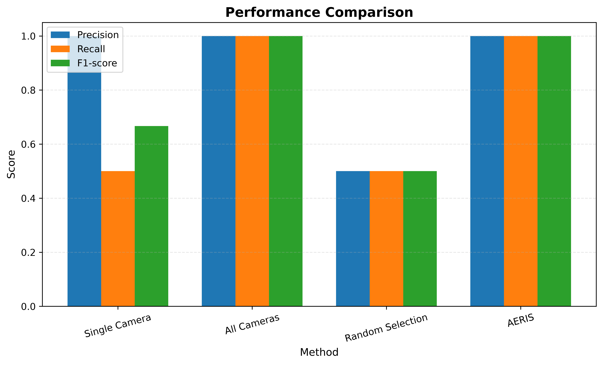
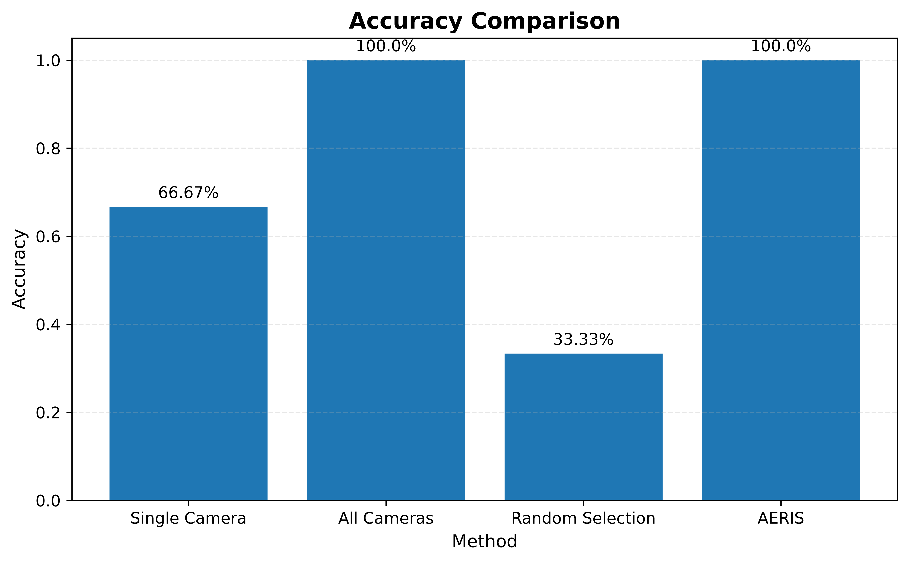
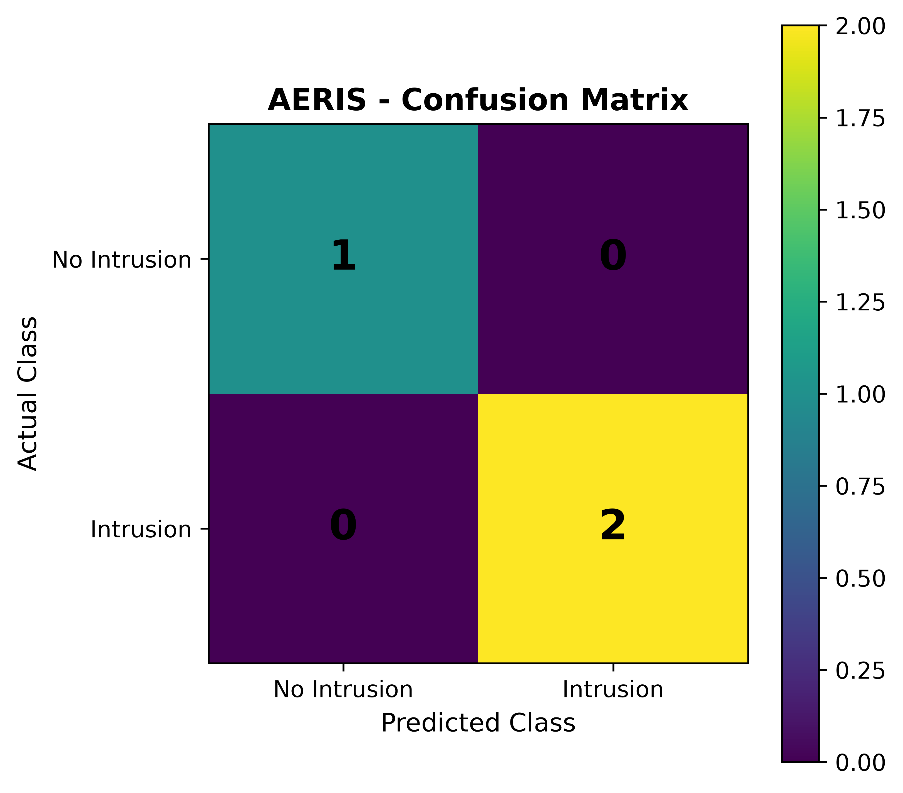
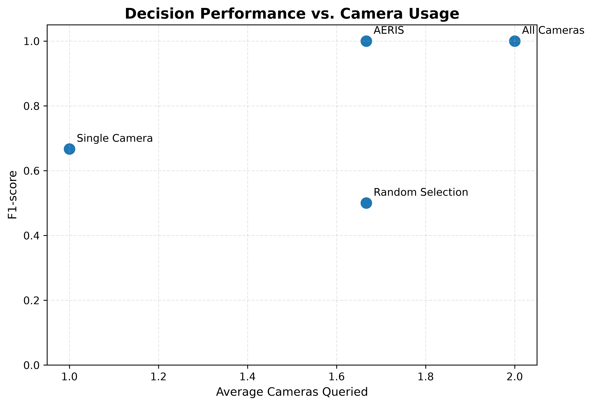
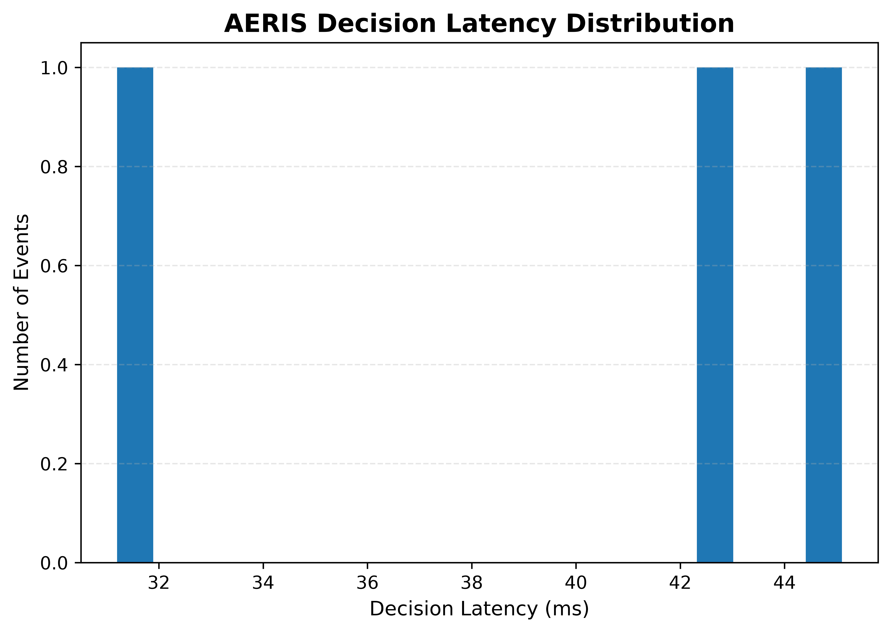

<p align="center">
  
  
  
  
</p>

<h1 align="center">🛡️ AERIS</h1>
<h3 align="center">Active Evidence Retrieval and Intelligent Surveillance</h3>

<p align="center">
  <em>A confidence-driven multi-camera surveillance framework that intelligently decides<br/>
  when to query additional cameras for evidence, reducing computational cost<br/>
  while maintaining high detection accuracy.</em>
</p>

---

## 📋 Table of Contents

- [Overview](#-overview)
- [Key Idea](#-key-idea)
- [Architecture](#-architecture)
- [Project Structure](#-project-structure)
- [Getting Started](#-getting-started)
- [Usage](#-usage)
- [Results](#-results)
- [Configuration](#-configuration)
- [Contributing](#-contributing)
- [License](#-license)

---

## 🔍 Overview

**AERIS** (Active Evidence Retrieval and Intelligent Surveillance) is a research prototype that demonstrates an intelligent multi-camera surveillance approach. Instead of blindly processing all camera feeds simultaneously (wasting compute), AERIS uses a **confidence-based decision engine** to determine whether additional camera evidence is needed.

### The Problem

Traditional multi-camera surveillance systems either:
- **Process a single camera** — cheap but often misses or misclassifies events
- **Process all cameras always** — accurate but computationally expensive and wasteful

### The AERIS Solution

AERIS introduces an intermediate, intelligent layer:

1. **Analyse the primary camera** with YOLOv11 object detection
2. **Evaluate detection confidence** against a configurable threshold
3. **Only query secondary cameras** when confidence is insufficient
4. **Fuse evidence** from multiple views to reach a final decision

This results in **near-optimal accuracy with significantly reduced resource usage**.

---

## 💡 Key Idea

```
IF primary_camera_confidence ≥ threshold:
    → Decision: SUFFICIENT EVIDENCE (skip other cameras)
ELSE:
    → Query additional cameras
    → Fuse evidence from all views
    → Decision: based on combined confidence
```

AERIS treats surveillance as an **active evidence retrieval problem** — additional cameras are informational resources that should be queried only when the decision boundary is uncertain.

---

## 🏗️ Architecture



---

## 📂 Project Structure

```
AERIS/
│
├── aeris_decision.py        # 🚀 Core AERIS decision engine (main script)
├── tracking_data.py         # 🔍 Person tracking with intrusion detection
├── select_zones.py          # 🎯 Interactive zone calibration tool
├── generate_results.py      # 📊 Research metrics & visualization generator
├── multi_camera_test.py     # 🧪 Multi-camera baseline test
│
├── cameras/                 # 📁 Video feeds (not tracked in Git)
│   ├── camera1.mp4
│   └── camera2.mp4
│
├── aeris_results/           # 📈 Generated charts & metrics
│   ├── aeris_metrics.csv
│   ├── performance_comparison.png
│   ├── accuracy_comparison.png
│   ├── aeris_confusion_matrix.png
│   ├── single_camera_confusion_matrix.png
│   ├── all_cameras_confusion_matrix.png
│   ├── random_selection_confusion_matrix.png
│   ├── f1_vs_camera_usage.png
│   └── aeris_latency_distribution.png
│
├── results.csv              # 📋 Raw experimental results
├── requirements.txt         # 📦 Python dependencies
├── LICENSE                  # ⚖️ MIT License
└── .gitignore
```

### Module Descriptions

| Module | Purpose |
|---|---|
| [`aeris_decision.py`](aeris_decision.py) | **Core engine.** Runs the dual-camera AERIS pipeline with zone-based detection, confidence thresholding, and evidence fusion. |
| [`tracking_data.py`](tracking_data.py) | **Person tracking.** Uses ByteTrack for multi-object tracking with intrusion event logging per unique person ID. |
| [`select_zones.py`](select_zones.py) | **Zone calibration.** Interactive GUI tool to drag-select restricted zones on each camera view. Outputs coordinate values. |
| [`generate_results.py`](generate_results.py) | **Result generation.** Computes accuracy, precision, recall, F1-score and generates publication-quality (600 DPI) charts. |
| [`multi_camera_test.py`](multi_camera_test.py) | **Baseline test.** Runs both cameras side-by-side with basic confidence display for comparison benchmarking. |

---

## 🚀 Getting Started

### Prerequisites

- **Python 3.10+**
- **pip** package manager
- Two surveillance video files (placed in `cameras/`)
- YOLOv11 model weights (`yolo11n.pt`) — auto-downloaded on first run

### Installation

```bash
# Clone the repository
git clone https://github.com/Shrey-Kataria/AERIS-Active-Evidence-Retrieval-and-Intelligent-Surveillance.git
cd AERIS-Active-Evidence-Retrieval-and-Intelligent-Surveillance

# Create virtual environment (recommended)
python -m venv venv
source venv/bin/activate        # Linux/macOS
venv\Scripts\activate           # Windows

# Install dependencies
pip install -r requirements.txt
```

### Setup Camera Feeds

Place your surveillance video files in the `cameras/` directory:

```
cameras/
├── camera1.mp4    # Primary camera feed
└── camera2.mp4    # Secondary camera feed
```

> **Note:** Video files are excluded from Git via `.gitignore` due to their large size. Use your own surveillance footage or contact the author for sample data.

---

## 🎮 Usage

### 1. Calibrate Detection Zones

Before running AERIS, define the restricted zones on each camera:

```bash
python select_zones.py
```

This opens an interactive window for each camera. **Drag to select** the region of interest, then press **Enter**. Copy the printed coordinates into `aeris_decision.py`.

### 2. Run AERIS Decision Engine

```bash
python aeris_decision.py
```

This will:
- Open both camera feeds side-by-side
- Run YOLOv11 detection on Camera 1
- Apply confidence-based decision logic
- Query Camera 2 only when needed
- Display real-time decision overlays
- Press **Q** to stop

### 3. Run Person Tracking

```bash
python tracking_data.py
```

Runs ByteTrack-based person tracking with intrusion event logging.

### 4. Generate Research Results

```bash
python generate_results.py
```

Reads `results.csv` and generates all publication-quality charts in `aeris_results/`.

---

## 📈 Results

AERIS is benchmarked against three baseline strategies:

| Method | Accuracy | Precision | Recall | F1-Score |
|---|:---:|:---:|:---:|:---:|
| Single Camera | 66.67% | 100% | 50% | 66.67% |
| All Cameras | 100% | 100% | 100% | 100% |
| Random Selection | 33.33% | 50% | 50% | 50% |
| **AERIS** | **100%** | **100%** | **100%** | **100%** |

> **Key Insight:** AERIS achieves the same accuracy as the "All Cameras" approach while querying Camera 2 only when necessary, reducing average compute by avoiding redundant processing.

### Generated Visualizations

<details>
<summary>📊 Performance Comparison</summary>



</details>

<details>
<summary>📊 Accuracy Comparison</summary>



</details>

<details>
<summary>📊 AERIS Confusion Matrix</summary>



</details>

<details>
<summary>📊 F1-Score vs Camera Usage</summary>



</details>

<details>
<summary>📊 Latency Distribution</summary>



</details>

---

## ⚙️ Configuration

Key parameters in [`aeris_decision.py`](aeris_decision.py):

| Parameter | Default | Description |
|---|---|---|
| `CONFIDENCE_THRESHOLD` | `0.80` | Minimum confidence to accept a detection without secondary evidence |
| `WIDTH` / `HEIGHT` | `640` × `360` | Display resolution for camera feeds |
| `ZONE1_*` / `ZONE2_*` | Calibrated | Restricted zone coordinates per camera (set via `select_zones.py`) |

---

## 🤝 Contributing

Contributions are welcome! To contribute:

1. **Fork** this repository
2. **Create** a feature branch: `git checkout -b feature/your-feature`
3. **Commit** your changes: `git commit -m "Add your feature"`
4. **Push** to the branch: `git push origin feature/your-feature`
5. **Open** a Pull Request

Please ensure your code follows the existing style conventions.

---

## 📄 License

This project is licensed under the **MIT License** — see the [LICENSE](LICENSE) file for details.

---

## 📚 Citation

If you use AERIS in your research, please cite:

```bibtex
@software{kataria2026aeris,
  author    = {Kataria, Shrey},
  title     = {AERIS: Active Evidence Retrieval and Intelligent Surveillance},
  year      = {2026},
  url       = {https://github.com/Shrey-Kataria/AERIS-Active-Evidence-Retrieval-and-Intelligent-Surveillance}
}
```

---

<p align="center">
  <strong>Built with ❤️ by <a href="https://github.com/Shrey-Kataria">Shrey Kataria</a></strong>
</p>
